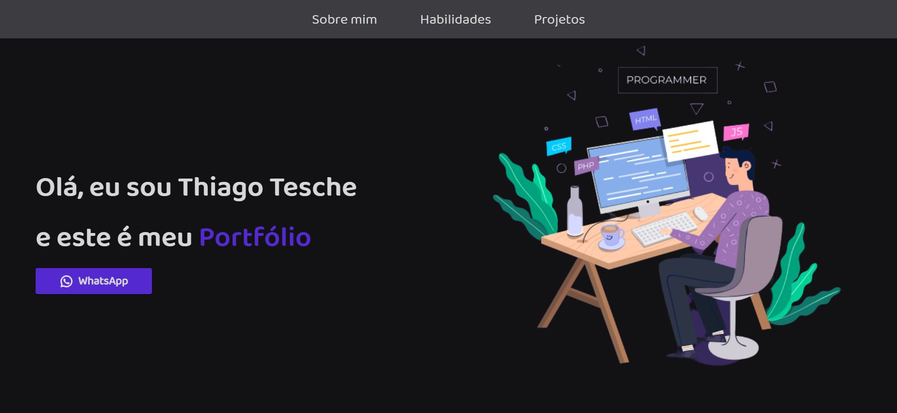

# Portfólio

;

## Table of contents

- [Overview](#overview)
  - [Description](#description)
  - [My design](#my-design)
    - [Desktop design](#desktop-desing)
    - [Mobile design](#mobile-design)
  - [Where to find everything](#where-to-find-everything)
  - [Link to site](#link-to-site)
- [My process](#my-process)
  - [Built with](#built-with)
  - [What I learned](#what-i-learned)
- [Author](#author)

<br>

# Overview

## Description

Esse é meu portfolio que contém as informações de contato, as minhas habilidades técnicas e habilidades interpessoais, meus hobbies e interesses e o meu currículo.  

<br>

## My design

# Desktop design


# Mobile design


## Where to find everything

-- The designs are inside the `/design` folder. You will find both a mobile and a desktop version of the design. 

-- The designs are in JPG static format. Using JPGs will mean that you'll need to use your best judgment for styles such as `font-size`, `padding` and `margin`. 

-- The css's archives are in `scss` folder.

### Link to site

- Live Site URL: [portfolio-thiago-tesche.netlify.app](https://portfolio-thiago-tesche.netlify.app/)

<br>

## My process

### Built with

- Semantic HTML5 markup
- CSS custom properties
- Flex
- Grid
- Media Queries
- SCSS
- Jquery
- Bootstrap

<br>

### What I learned

Construindo esse projeto, eu aprendi sobre menu âncora, aprendi também ao clicar em botões, fazer com que abra um página, outra coisa que aprendi foi sobre como colocar para abrir em uma nova página um arquivo em pdf.   
```HTML
<button type="button" class="download-curriculo" onclick="window.open('assets/Curriculo.pdf')">Curriculum</button>
```
```css
.image{
  width: 50%;
  height: 100%;
  padding-top: 6%;

  .bgFundo{
    width: 420px;
    border-radius: 50%;
    height: 380px;
    background-color: var(--roxo-azulado);
    z-index: 1;
    padding-right: 20px;
    margin-left: 30px;
      
    img{
      z-index: 2;
      margin-left: -10px;
      margin-top: 48px;
      width: 150%;
    }
  }  
}
```
```javascript
$('#btn-linkedin').click(function(){
    window.open("https://www.linkedin.com/in/thiago-tesche-996b52213/");
});

$('#open-linkedin-icon').click(function(){
    window.open("https://www.linkedin.com/in/thiago-tesche-996b52213/");
});

$('#open-github-icon').click(function(){
    window.open("https://github.com/ThiagoTesche/");
});

$("#open-instagram-icon").click(function(){
    window.open("https://www.instagram.com/thiago_tesche/");
});

$("#btn-whatsapp-open").click(function(){
    window.open("https://api.whatsapp.com/send?phone=5551989518849");
});

$('#sobre-mim-menu').click(function(){
    var about = document.getElementById("about");
    about.scrollIntoView();

});

$("#habilidades-menu").click(function(){
    var habilidade = document.getElementById("habilidades-view");
    habilidade.scrollIntoView();
});

$("#projetos-menu").click(function(){
    var projetos = document.getElementById("projetos-view");
    projetos.scrollIntoView();
});
```

<br>

<br>

## Author

- Author - Thiago Tesche
- Instagram - [@thiago_tesche](https://www.instagram.com/thiago_tesche/)
- LinkedIn - [Thiago Tesche](https://www.linkedin.com/in/thiago-tesche-996b52213/)


<strong>Thank You!</strong>